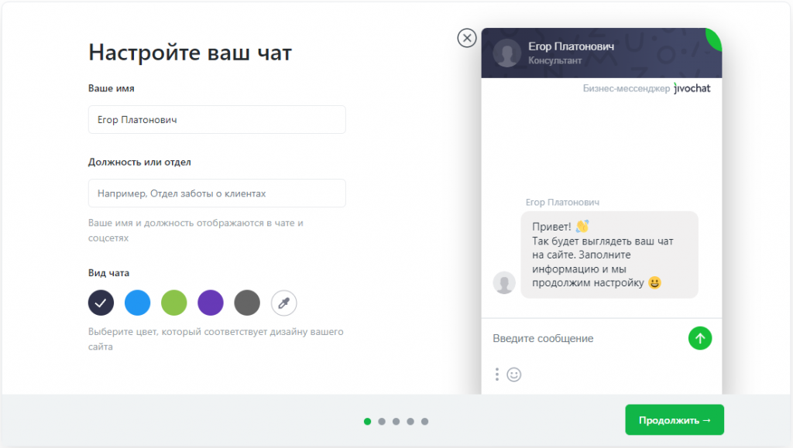
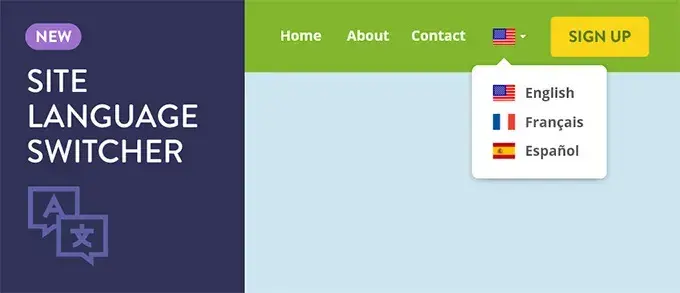

# Course work on Database management and automation
 Индивидуальный проект по теме: Разработка и администрирование базы данных благотворительного фонда по психологической помощи.
 

  

    
    
    
  

# TimeTo
TimeTo- это веб приложение для благотворительного фонда "Время жить!". Приложение рассчитано на управление курсами и лекциями в рамках фонда. Лёгкое управление пользователями и файлами. Доступ к личным сообщениям прямо в системе. 

# Начало работы
Для использования веб-приложения, разработанного в рамках проекта "Разработка и администрирование базы данных благотворительного фонда по психологической помощи", необходимо выполнение следующих условий:

#### Системные требования:

- Операционная система: Windows.
- Минимум 4 ГБ оперативной памяти.
- Доступ к сети интернет для взаимодействия с сервером и базой данных.

#### Программные инструменты:

- Серверная часть: Для работы требуется установленный сервер с поддержкой Node.js (или Python/Django), PostgreSQL (или MySQL), и WebSocket для обмена сообщениями в реальном времени.
- Клиентская часть: Установленный веб-браузер (Google Chrome, Mozilla Firefox и др.) для доступа к пользовательскому интерфейсу.
- Python 3.9+ или Node.js: Необходимо для запуска серверной части.
- PostgreSQL/MySQL: Необходимы для работы с базой данных. Убедитесь, что установлен один из этих реляционных СУБД.

# Как установить программу
Опишите шаги инсталляции! Если процесс установки достаточно длинный
(сложный), обязательно разбейте его на отдельные этапы и пронумеруйте их.
# Порядок использования
После установки и запуска программы пользователи могут начать работу с веб-приложением через браузер. Примерный порядок использования следующий:

1. Регистрация пользователя:

    - Перейдите на страницу регистрации.
    - Введите необходимые данные (имя, электронная почта, пароль) и выберите предпочитаемый язык интерфейса (русский, английский, немецкий, казахский).
    - Подтвердите регистрацию через ссылку, отправленную на почту.

2. Авторизация:

    - Войдите в систему с помощью своей электронной почты и пароля.
 

  

3. Управление курсами:

    - Сотрудники могут создавать новые курсы в разделе "Курсы", указывая описание, сроки проведения и назначая участников.
    - Клиенты могут просматривать доступные курсы и записываться на них через интерфейс.

4. Обмен сообщениями:

    - В разделе "Чат" сотрудники могут вести переписку с клиентами в реальном времени. Реализован функционал отправки текстовых сообщений и файлов.
 

  

5. Загрузка и управление файлами:

    - Сотрудники могут загружать фото, видео и документы в систему через соответствующий раздел "Файлы".
    - Для каждого файла можно назначить права доступа, чтобы ограничить или разрешить просмотр определенным пользователям.
 

  

6. Переключение языков интерфейса:

    - Пользователь может в любой момент изменить язык интерфейса через настройки профиля.
 

  

# Контакты

